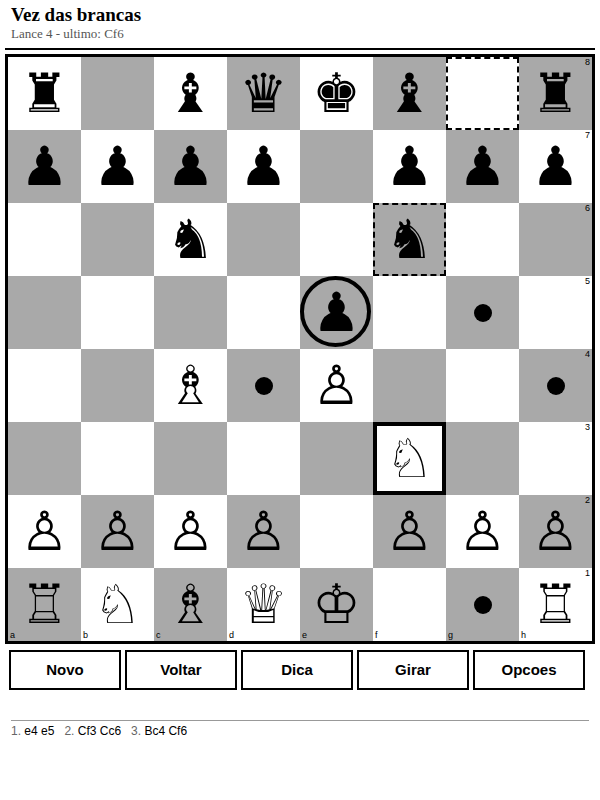

# Xadrez para Kindle

Um jogo de xadrez completo que roda no navegador experimental do Kindle.
Sem internet, sem instalação, sem dependências: um arquivo HTML de 65 KB.



## Por que não dá para usar um xadrez qualquer da web

O navegador do Kindle é um WebKit de 2012 rodando num processador lento,
numa tela de tinta eletrônica com 16 tons de cinza que leva quase meio
segundo para redesenhar. Isso derruba praticamente todo jogo moderno:

| Problema | O que foi feito aqui |
| --- | --- |
| Sem `let`, `const`, arrow, `Map`, typed arrays | Tudo em JavaScript ES5 |
| Sem flexbox, grid, `vw`/`vh` | Medidas calculadas em JS e aplicadas em pixels |
| Tela lenta e com "fantasmas" | Zero animação; só a casa que mudou é repintada |
| Só tons de cinza | Preto, branco e um cinza médio; nada de cor |
| Processador fraco | A IA busca por **tempo**, não por profundidade fixa |
| Aviso de "script travado" | A busca é fatiada e devolve o controle ao navegador |
| Fonte sem símbolos de xadrez | Detecta na hora e cai para peças em letras |
| Toque impreciso | Casas grandes e botões de 40 px de altura |

## Como colocar no Kindle

O que interessa é o arquivo **`dist/xadrez-kindle.html`**. Escolha um caminho:

**1. Por cabo USB (não precisa de internet depois)**

1. Conecte o Kindle ao computador pelo USB.
2. Copie `dist/xadrez-kindle.html` para a raiz do Kindle (ou para
   `documents/`).
3. Desconecte, abra o navegador (menu ▸ *Navegador experimental*) e digite:
   `file:///mnt/us/xadrez-kindle.html`
   (se você copiou para `documents/`, use `file:///mnt/us/documents/xadrez-kindle.html`).
4. Salve nos favoritos para não digitar de novo.

Alguns modelos mais novos bloqueiam `file://` no navegador. Se a página não
abrir, use uma das opções abaixo.

**2. Servindo do seu computador pela mesma rede Wi-Fi**

```bash
cd dist && python3 -m http.server 8000
```

No Kindle, abra `http://IP-DO-COMPUTADOR:8000/xadrez-kindle.html`
(o IP aparece com `ip addr` no Linux, `ipconfig` no Windows).

**3. Publicando na web (GitHub Pages)**

O repositório traz o workflow `.github/workflows/pages.yml`, que gera o
arquivo único e o publica como `index.html` do site a cada push na `main`.
Para ligar, uma vez só:

1. O repositório precisa ser **público** (Pages em repositório privado exige
   conta GitHub Pro): *Settings ▸ General ▸ Danger Zone ▸ Change visibility*.
2. *Actions ▸ Publicar no GitHub Pages ▸ Run workflow* (ou faça um push na
   `main`). O workflow liga o Pages sozinho na primeira execução — não
   precisa mexer em *Settings ▸ Pages*.

O endereço fica `https://SEU-USUARIO.github.io/xadrez-kindle/` — sem nome de
arquivo no fim, porque o jogo é o `index.html` do site. No Kindle, digite uma
vez e salve nos favoritos.

O site é uma requisição só: 65 KB e nada mais é buscado na rede durante a
partida. Kindles muito antigos (Kindle 3/4/Touch) podem recusar o HTTPS
moderno que o `github.io` obriga; se aparecer erro de conexão segura, use o
cabo USB ou o servidor na rede local.

## Como jogar

- **Mover**: toque na peça e depois na casa de destino. Os destinos possíveis
  aparecem marcados com um ponto (captura vira um anel).
- **Desistir da seleção**: toque em qualquer casa vazia.
- **Promoção**: ao chegar na última fileira, aparece um menu com Dama, Torre,
  Bispo e Cavalo.
- **Botões**: `Novo`, `Voltar` (desfaz sua jogada e a do computador),
  `Dica` (mostra o lance que o computador jogaria), `Girar` (vira o
  tabuleiro), `Opções`.
- **Teclado**, nos Kindles que têm setas ou teclado físico: setas movem o
  cursor, Enter seleciona, e ainda `n` (novo), `u` (voltar), `h` (dica),
  `f` (girar), `m` (opções).

A partida é salva sozinha a cada lance. Se a tela apagar ou o navegador
fechar, é só reabrir que ela continua de onde parou.

## Opções

- **Adversário**: computador ou dois jogadores no mesmo aparelho.
- **Nível**: Fácil, Médio, Difícil e Mestre. Como o limite é de tempo
  (0,4 s a 9 s por lance), o mesmo nível se comporta igual num Kindle velho
  e num aparelho rápido — ele só enxerga menos fundo no aparelho lento.
- **Você joga de**: brancas ou pretas (o tabuleiro gira sozinho).
- **Desenho das peças**: símbolos (♞) ou letras (R D T B C P, em círculos
  pretos e brancos). O jogo detecta se a fonte do aparelho tem os símbolos
  de xadrez e escolhe sozinho — as letras são bem mais legíveis em telas
  pequenas de e-ink.
- **Ajudas**: marcar os lances possíveis e mostrar as coordenadas.
- **Limpar fantasmas**: pisca a tela em preto para apagar o resíduo das
  peças antigas, o truque de sempre no e-ink.
- **Posição (FEN)**: mostra a posição atual e permite carregar outra — útil
  para estudar uma abertura ou um problema.

## Regras implementadas

Todas: roque (curto e longo, com todas as restrições), *en passant*,
promoção com escolha de peça, xeque, xeque-mate, afogamento, regra dos 50
lances, repetição tripla e material insuficiente. A notação é a algébrica
em português (R, D, T, B, C).

A correção do gerador de lances é verificada por *perft* em seis posições
padrão, incluindo a "kiwipete", até 197.281 posições — é o teste que pega
os erros clássicos de roque e *en passant*.

## Estrutura

```
index.html          versão de desenvolvimento (arquivos separados)
css/style.css       visual pensado para e-ink
js/engine.js        motor: tabuleiro 0x88, regras, FEN, notação
js/ai.js            adversário: negamax, alfa-beta, quiescência
js/ui.js            interface: layout calculado, toque, teclado
build.py            junta tudo em dist/xadrez-kindle.html
testes/motor.js     perft + táticas + partida da IA contra ela mesma
testes/navegador.js interface num Chromium, nos tamanhos de tela do Kindle
```

## Desenvolvendo

```bash
python3 -m http.server 8000      # abra http://localhost:8000
node testes/motor.js             # sem dependências
npm i playwright                 # só para os testes de interface
node testes/navegador.js         # testa index.html
python3 build.py                 # gera dist/xadrez-kindle.html
node testes/navegador.js dist    # testa o arquivo final
```

**Sempre rode `python3 build.py` depois de mexer em `js/` ou `css/`** — o
arquivo em `dist/` é uma cópia embutida, não é gerado na hora. O workflow
`.github/workflows/testes.yml` roda os dois testes a cada push e recusa o
commit em que `dist/` ficou para trás do código.

## Sobre o adversário

Negamax com poda alfa-beta, busca de quiescência (só capturas, para não
avaliar posições no meio de uma troca), extensão de xeque, ordenação de
lances por MVV-LVA e *killer moves*, e aprofundamento iterativo até acabar
o tempo. A avaliação soma material, tabelas de posição por peça, par de
bispos e peões dobrados/isolados, e troca a tabela do rei no final de
partida para ele marchar ao centro.

No nível Fácil ele escolhe ao acaso entre os lances quase equivalentes, para
não repetir sempre a mesma partida e para errar de vez em quando.
